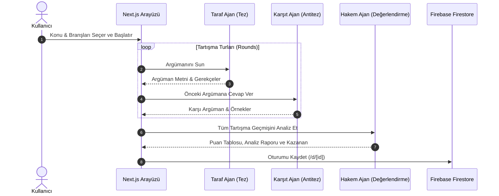

# 🎭 Yapay Zeka Tartışma Platformu - Multi-Agent AI Debate & Evaluation System

[](https://www.typescriptlang.org/)
[](https://nextjs.org/)
[](https://reactjs.org/)
[](https://firebase.google.com/)
[](https://deepmind.google/technologies/gemini/)
[](https://www.yucelgumus.dev/)

> Farklı uzmanlık alanlarına ve bakış açılarına sahip yapay zeka ajanlarının (Felsefe, Bilim, Etik, Teknoloji, Ekonomi vb.) belirlenen bir tez veya konu üzerinde gerçek zamanlı olarak tartıştığı; sürecin sonunda tarafsız bir **Hakem Ajan (Judge Agent)** tarafından argümanların puanlanıp karara bağlandığı çoklu ajan (Multi-Agent) simülasyon ve paylaşım platformu.

---

## 🌟 Öne Çıkan Özellikler

- 🤖 **Çoklu Ajan Tartışma Simülasyonu (Multi-Agent Debate):** Kullanıcının belirlediği konu üzerinde en az iki farklı uzman ajanın sırayla argüman ve antitez üretmesini sağlar (`useDebateLogic.ts`).
- ⚖️ **Tarafsız Hakem Ajanı (Judge Agent):** Tartışma tamamlandığında argümanların mantıksal tutarlılığını, kanıt gücünü ve ikna ediciliğini değerlendirerek kazananı ve ayrıntılı gerekçeli kararı açıklar (`JudgePopup.tsx`, `/api/judge`).
- 🌐 **Paylaşılabilir Tartışma Bağlantıları (Shareable URLs):** Tamamlanan oturumları **Firebase Firestore** üzerinde saklayarak `/d/[id]` dinamik rotası üzerinden herkese açık paylaşabilme (`ShareModal.tsx`).
- 🌿 **Özelleştirilebilir Branş & Perspektif Yönetimi:** Kullanıcının tartışmaya yeni uzmanlık dalları veya özel kişilik profilleri ekleyebilmesi (`branches.json`, `AddBranchModal.tsx`).
- ✨ **Yapay Zeka Destekli Konu & Açıklama Üretimi:** Tek tıkla ilgi çekici ve düşündürücü tartışma konuları öneren yardımcı ajan (`/api/generate-description`).

---

## 🏗️ Mimari & Çoklu Ajan Karar Döngüsü



---

## 🛠️ Teknoloji Yığını

| Kategori | Teknoloji / Kütüphane | Açıklama |
| :--- | :--- | :--- |
| **Framework & UI** | Next.js 15 (App Router) + React 19 | Modern ve reaktif web altyapısı |
| **Yapay Zeka** | Google Gemini 1.5 Pro / Flash | Çoklu ajan karakterleri ve hakem mantığı |
| **Veritabanı** | Firebase Firestore | Tartışma geçmişlerinin saklanması ve paylaşımı |
| **Stil & Tasarım** | Tailwind CSS + Lucide Icons | Canlı mesaj balonları ve şık modallar |

---

## 🚀 Hızlı Başlangıç

### Gereksinimler
- **Node.js**: v18.18+ veya v20+
- **Google Gemini API Key**
- **Firebase Projesi Yapılandırması**

### Kurulum

```bash
git clone https://github.com/yucel-gumus/yapay-zeka-tartisma-platformu.git
cd yapay-zeka-tartisma-platformu

npm install
```

### Ortam Değişkenleri (`.env.local`)

```env
GEMINI_API_KEY=your_gemini_api_key
NEXT_PUBLIC_FIREBASE_API_KEY=your_firebase_api_key
NEXT_PUBLIC_FIREBASE_AUTH_DOMAIN=your_project.firebaseapp.com
NEXT_PUBLIC_FIREBASE_PROJECT_ID=your_project_id
NEXT_PUBLIC_FIREBASE_STORAGE_BUCKET=your_project.appspot.com
NEXT_PUBLIC_FIREBASE_MESSAGING_SENDER_ID=your_sender_id
NEXT_PUBLIC_FIREBASE_APP_ID=your_app_id
```

### Çalıştırma

```bash
npm run dev
```

Uygulamaya `http://localhost:3000` adresinden erişebilirsiniz.

---

## 📂 Proje Dizin Yapısı

```
yapay-zeka-tartisma-platformu/
├── package.json
├── tailwind.config.ts
├── next.config.ts
└── src/
    ├── app/
    │   ├── page.tsx                    # Ana tartışma oluşturma ekranı
    │   ├── d/[id]/page.tsx             # Paylaşılan tartışma detay sayfası
    │   └── api/
    │       ├── chat/route.ts           # Ajan konuşma API'si
    │       ├── judge/route.ts          # Hakem değerlendirme API'si
    │       └── generate-description/   # Konu öneri API'si
    ├── components/
    │   ├── DebateSetup.tsx             # Konu ve ajan seçici panel
    │   ├── ChatDisplay.tsx             # Canlı tartışma akışı
    │   ├── ChatMessage.tsx             # Ajan mesaj kutusu
    │   ├── JudgePopup.tsx              # Hakem karar kartı
    │   └── ShareModal.tsx              # Paylaşım bağlantı modali
    ├── hooks/
    │   ├── useDebateLogic.ts           # Tartışma tur yönetimi
    │   └── useBranchManagement.ts     # Branş ve uzmanlık yönetimi
    └── lib/
        ├── firebase.ts                 # Firestore entegrasyonu
        └── gateway.ts                  # Gemini API yönlendirici
```

---

## 📄 Lisans
Bu proje [MIT Lisansı](LICENSE) ile lisanslanmıştır.

---

## 👨‍💻 Geliştirici & İletişim

**Yücel Gümüş** - Full Stack Developer

- 🌐 **Web Sitesi / Portfolyo:** [yucelgumus.dev](https://www.yucelgumus.dev/)
- 💼 **LinkedIn:** [linkedin.com/in/yucel-gumus](https://www.linkedin.com/in/yucel-gumus/)
- 🐙 **GitHub:** [@yucel-gumus](https://github.com/yucel-gumus)

<p align="left">
  <a href="https://www.yucelgumus.dev/" target="_blank" rel="noopener noreferrer">
    
  </a>
</p>
